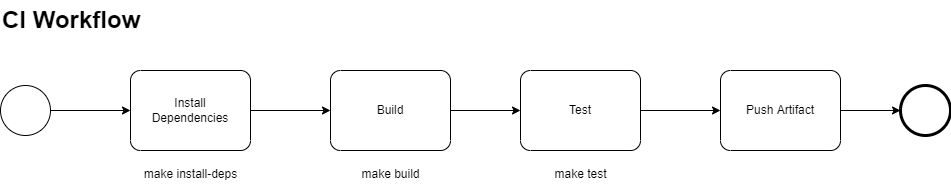

# Welcome to the Serenade QE Challenge

## Project Setup

Details about the directory structure and implemented functionality can be found in the [README](README.md)

> **ProTip:** Remember to update the README as you progress through the exercise. 

 

## Overview
___

For this challenge, you will need to implement a suite of tests to verify that a PetStore API is working as expected. These tests will eventually be plugged into a CI/CD pipeline and run each time a code change is made.

Each concrete step must be encapsulated as a **Make target** which is executed using the [3Musketeers pattern](https://3musketeers.io/) so that our build process need not be coupled to any particular CI/CD tool.

`build` and `test` targets have been created as placeholders in the `Makefile`. If these are inadequate or wrong for your propose solution, feel free to change them.

> **Note:** You do not need to implement a working CI/CD pipeline, just the specific targets.

## API Specification
___

The [PetStore API](open-api-spec/pet-store-open-api-spec-v1.yml) has three operations that need to be tested:

* List All Pets
* Get Pet by ID
* Create Pet

## Challenge Tasks
___

### Task 1 : Mock Server Configuration

A MockServer has been made available to you to build your test suite. In it's current state, the MockServer does not have any responses configured. The sample responses you will need to complete the rest of the challenge are located in the `mock-server-config` directory.

Your first task is to ensure that when we execute `make start-mock-server` that the provided request matchers and responses are automatically loaded into the MockServer.

### Task 2 : Create a Test Suite

Now that we have some sample responses, we can get started on the test suite.

The test suite must be written in TypeScript using JS testing framework(s). You may use whichever test framework you prefer, with justification as to why you chose it.

A basic `package.json` file has been included as a part of the project for you to get started.

For this task, you must:

* Create a happy path test for List All Pets API
* Create a happy path test for Get Pet by ID API

### Task 3 : Create error scenarios for Get Pet by ID

Implement tests for error scenarios described in the Get Pet By ID API.

### Task 4 : Performance test

At some point, we will want to execute basic load tests from a CI/CD pipeline as well.

The final task, is to implement a brand new make target which will trigger a load testing cycle.

The load test should last for a 2 min duration with a sustained load of 1 transactions per second.

You may use whichever test framework you prefer, with justification as to why you chose it.

## Submitting your work

* It would be great it if you could submit your work via a private GitHub link. Private because it would be unfair if other candidates who may find copy your code as their own work. If you do not have a a private account, Public will be fine as long as you are able to delete it after it has been assessed.
* Please make it easy for us to understand your code vs the base project e.g. (raise PR)

## Useful Links
___

### 3Musketeers Pattern

* https://3musketeers.io/
* https://github.com/flemay/3musketeers

### Mockserver

* https://mock-server.com/
* https://github.com/mock-server/mockserver/tree/master/mockserver-examples/docker_compose_examples	
* https://github.com/mock-server/mockserver/blob/master/mockserver-examples/json_examples.md

