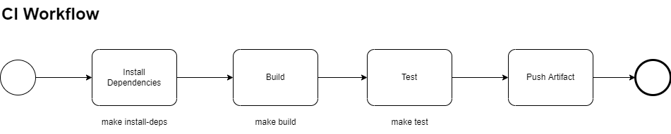

# Pet Store Service

## Overview

This project is to house a Pet Store service which exposes several APIs to add and retrieve pets.

THe project uses a contract first development methodology where by the interface contract is developed first, allowing the testing and development to be developed independently.

As the services is being built in parallel, a MockServer should be used to build tests against.

## Dependencies

* Make
* Docker
* Docker Compose
* VSCode Extensions:
	* Docker Extension (Microsoft)
	* Makefile Tools (Microsoft)
	* YAML (RedHat)

## Build

To build this project, we use the [3Musketeers pattern](https://3musketeers.io/).

There are three main benefits we get from using this pattern:

* Run the same commands no matter where you are: Linux, MacOS, Windows, CI/CD tools that supports Docker like GitHub Actions, Travis CI, CircleCI, and GitLab CI.
* Test your code and pipelines locally before your CI/CD tool runs it. Feel confident that if it works locally, it will work in your CI/CD server.
* Take control of languages, versions, and tools you need, and version source control your pipelines with your preferred VCS like GitHub and GitLab.

### Target CI Workflow

Each concrete step must be encapsulated as a **Make target**.

### Make Targets

* `start-mock-server` - Starts the MockServer to mock API responses.
* `stop-mock-server` - Stops the MockServer to mock API responses.
* `install-deps` - Installs node dependencies to the mounted volume.
* `upgrade-deps` - Upgrades the node dependencies in the mounted volume.
* `build` - NOT IMPLEMENTED YET.
* `test` - NOT IMPLEMENTED YET.
* `shell` - Executes an arbitraty shell command in the target docker container.
* `cleanDocker` - gracefully shits down dockercompose process and removes orphan containers.
* `clean` - Cleans up node_modules and yarn meta files.

## How to

To start / stop the mock server execute the relevant make target with `mock-server` suffix.

To build and execute tests:

`make start-mock-server`
`make install-deps`
`make perfTest`
`make build`
`make test`

